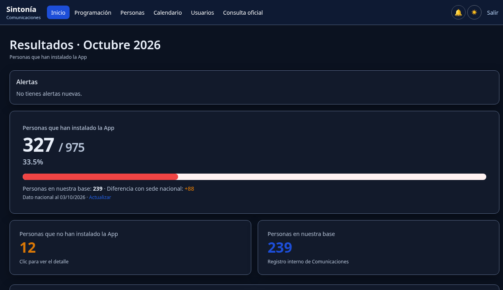
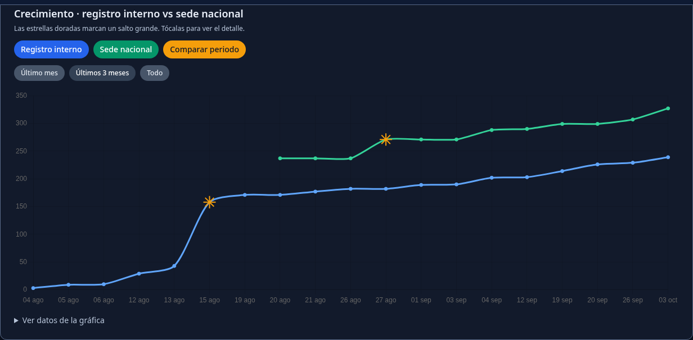
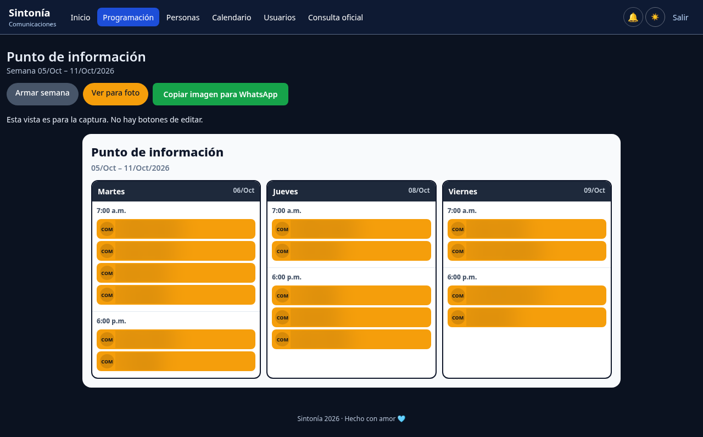

# Sintonía

Aplicación interna (Python · FastAPI) para coordinar equipos: registro de instalación, programación del punto de información y avance frente a sede nacional.

Resuelve duplicados (el celular es el identificador), compara el registro interno con el dato oficial de sede nacional y genera un informe semanal listo para pegar en WhatsApp.

Se usa en campo, con listados Excel y una meta de instalación. El acceso es con login: es un demo operativo, no un sitio abierto.

**Stack:** FastAPI, SQLite/SQLAlchemy, Jinja2, Tailwind (CDN), Chart.js, html2canvas · Python 3.12 (`runtime.txt`).

**Demo:** [sintonia-app.up.railway.app](https://sintonia-app.up.railway.app/) (requiere login).

## Producto

- **Carga de Excel** (`/upload`) e **historial de cargas** (`/cargas`): el celular identifica a la persona. No se duplica ni se revierte quien ya figura como Instalada.
- **Dashboard** (`/dashboard`): avance contra la meta de 975, dato de sede nacional, alertas, gráfica de crecimiento interno vs nacional y comparación de un periodo (dos puntos). Informe semanal para WhatsApp (`/informe`).
- **Personas** (`/personas`): búsqueda por nombre o celular (tolera espacios y prefijo `57`) y filtro por estado. El seguimiento de quienes no han instalado se asigna en la app.
- **Programación** (`/programacion`): turnos por horario. Se busca o se crea la persona al asignar. La vista «Ver para foto» copia una imagen para WhatsApp.
- **Programación de Sonido:** la misma ruta, con la cuenta `sonido`. En festivo laboral el horario pasa a 8:00 a. m. y 5:00 p. m., y el día se marca en la foto.
- **Horario FIMLM:** la delegación `fimlm` no está limitada por el calendario del punto. Si reserva un horario, queda bloqueado para el resto.
- **Calendario del punto** (`/config-punto`): vigencia, días de lunes a sábado, festivos de Colombia y domingos habilitados a mano.
- **Podio** (`/podio`): ranking anual de turnos, solo de semanas ya cerradas.
- **Usuarios por delegación** (`/usuarios`): `comunicaciones`, `politica`, `juventudes`, `electoral`, `fimlm` y `sonido`. Comunicaciones tiene el acceso completo. Las demás operan sobre programación y el dashboard.
- **Tema oscuro por defecto**, con paso a modo claro.

## Instalación local (Linux)

Requisito: Python 3.12 y Git.

```bash
git clone https://github.com/crearbots/sintonia.git
cd sintonia

python3 -m venv env
source env/bin/activate
pip install -r requirements.txt

python3 -m uvicorn app.main:app --reload --host 127.0.0.1 --port 8000
```

También se puede arrancar con `python3 run.py`.

Abrir: http://127.0.0.1:8000/login

La base SQLite se crea sola. No la subas a GitHub.

## Credenciales

| Concepto | Detalle |
| --- | --- |
| Cuenta principal | `APP_USER` / `APP_PASSWORD`, cuenta de Comunicaciones |
| Arranque | En cada inicio la contraseña de esa cuenta se restablece desde `APP_PASSWORD` |
| Otras cuentas | Se crean en `/usuarios`, una por delegación |
| Producción | Definir siempre `APP_USER`, `APP_PASSWORD` y `SECRET_KEY` |

En local, si no defines las variables, hay valores de desarrollo. No publiques esa contraseña.

## Formato del Excel

Columnas (el orden y las mayúsculas no importan): **Nombre**, **Celular**, **Estado**.

| Campo | Alias |
| --- | --- |
| Nombre | `nombre`, `hnos/hnas`, `hnos`, `hnas`, `name` |
| Celular | `celular`, `telefono`, `teléfono`, `tel`, `phone`, `móvil`, `movil` |
| Estado | `estado`, `status`, `tiene app`, `instalada` |

| Estado | Qué ocurre |
| --- | --- |
| Instalada | Entra al registro si el celular es válido (10 dígitos; también se acepta prefijo `57`) |
| No instalada | Queda en seguimiento; el motivo se asigna en la app |

- El celular es el identificador. Si ya existe, se actualiza; no se duplica.
- Si la persona ya es Instalada, un listado posterior en “No instalada” no la revierte.
- `fecha_listado` se guarda la primera vez y no se pisa al volver a subir el mismo archivo.
- Al cargar se pide fuente, fecha del listado y equipo.
- La interfaz pide `.xlsx` (máximo 5 MB).

## Variables de entorno (producción)

| Variable | Uso |
| --- | --- |
| `APP_USER` | Usuario principal (Comunicaciones) |
| `APP_PASSWORD` | Contraseña (se aplica al arrancar) |
| `SECRET_KEY` | Firma de sesiones (fija entre reinicios) |
| `DATABASE_PATH` | Ruta del archivo `.db` |

En Railway el volumen va en `/data` y `DATABASE_PATH=/data/infomira_censo.db`. Esa ruta no se renombra: es el archivo que ya usa el volumen.

## Despliegue

Fuente de verdad: GitHub, rama **`master`**. Un push a `master` dispara el deploy en Railway.

1. Respaldo del volumen `/data` en Railway.
2. Probar en local.
3. `git pull origin master` y push a `master`.
4. Verificar el deploy (login y una revisión del dashboard).

## Versiones

Los cortes estables están en los [tags](https://github.com/crearbots/sintonia/tags). Último: **v1.14.0**.

| Tag | Resumen |
| --- | --- |
| v1.1.0 | Excel robusto, personas y seguimiento, dato de sede nacional, historial de cargas |
| v1.2.0 | Dashboard del informe mensual y footer |
| v1.3.0 | `fecha_listado` estable, fuentes desde cargas, contacto WhatsApp |
| v1.4.0 | Editar y eliminar personas, consulta oficial y alerta del informe |
| v1.5.0 | Dashboard y tema oscuro |
| v1.6.0 | Ajustes de diseño: tokens, navegación móvil, carga e informe |
| v1.7.0 | Búsqueda de celular normalizada y comparar periodo en la gráfica |
| v1.8.0 | Programación del punto, roles por delegación y alertas |
| v1.9.0 | Nombre Sintonía y menú en pantalla partida |
| v1.10.0 | Calendario del punto, festivos, podio y recordatorio de domingo |
| v1.11.0 | Meta 975 y menú híbrido |
| v1.13.0 | Foto de programación para WhatsApp y festivo en Sonido |
| v1.14.0 | Turnos sugeridos en Sonido, fuente del punto, foto en celular y pie en todas las pantallas |

## Privacidad

No subir a GitHub bases `.db`, respaldos ni Excel con datos reales.

## UI

- Un botón primario azul por pantalla.
- WhatsApp y copiar informe: verde.
- Eliminar: rojo, siempre con confirmación.
- Tema oscuro por defecto. El interruptor a modo claro está en el encabezado.

## Capturas

Dashboard, octubre 2026.



Crecimiento interno frente a sede nacional.



Programación lista para copiar a WhatsApp.



---

Sebastian Romero · [Portafolio](https://crearbots.github.io/portafolio/) · [GitHub](https://github.com/crearbots)
